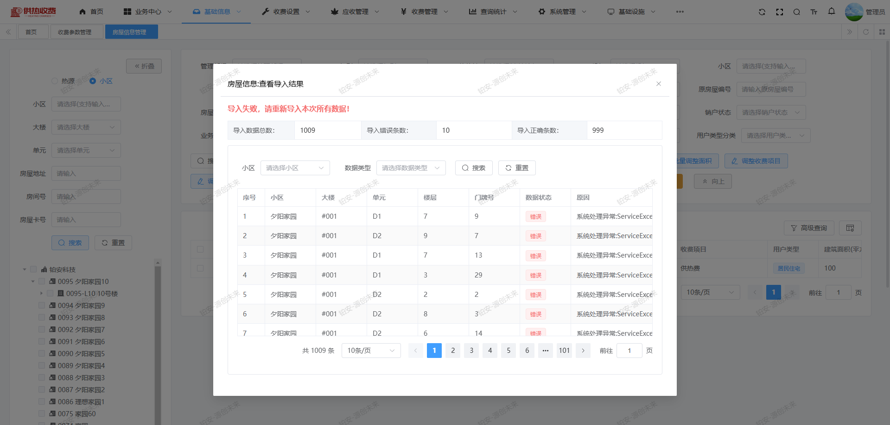
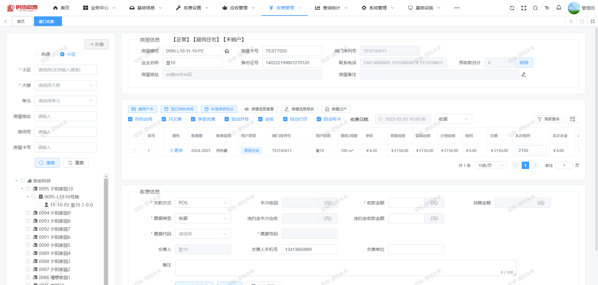
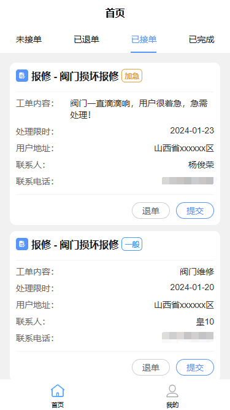

# 供热收费生态系统：实现高效运营的综合服务解决方案

#### 介绍
供热收费生态系统旨在提供高效、透明的供热服务收费管理，通过智能化手段提高用户体验，确保收费的准确性与及时性。该生态系统主要由供热收费系统、客服热线系统、热能服务APP和微信H5平台组成。

#### 软件架构
软件架构说明

> 核心技术栈

| 软件名称  | 描述 | 版本
|---|---|---
|Node | JavaScript 运行时环境 | >= 12
|Vue | JavaScript 框架 | 2.7.14
|Vuex | 状态管理 | 3.6.2
|Vue-router | 路由管理 | 3.5.3
|Element-ui | 前端UI框架 | 2.15.1

#### 系统部分截图
## 1. 基础信息

在该模块下，可以维护以下关键信息：
***
* 管网热源：记录供热系统中各个热源的详细信息，包括热源类型、位置、供热能力等，以便于管理和调度。
* 小区大楼：维护各个小区和大楼的基本信息，包括地址、供热面积、住户数量等，确保准确的供热服务。
* 合同信息：管理与用户之间的供热合同，包括合同编号、签署日期、有效期、条款等，以便于后续查询和管理。
* 收费站点：记录各个收费站点的位置信息、负责人员、工作时间等，以优化收费流程和服务。

## 2. 收费设置

在收费设置模块中，可以维护多种收费配置项，如：
***
* 收费参数：设定基本收费标准，包括用热面积、用热时间等因素。
* 收费项目：定义不同的收费项目，诸如基础费、使用费、服务费等，以满足不同用户的需求。
* 收费标准：依据不同季节、用热时段等设定不同的收费标准，确保收费的公平性。
* 优惠政策：维护和更新用户的优惠信息，包括节假日优惠、忠诚客户折扣等，以吸引和保留客户。
* 补贴公式：设定补贴方案和计算公式，确保符合政策要求，同时帮助用户降低费用。

## 3. 应收设置

应收管理模块提供多种功能以支持财务管理：
***
* 年度初始化：支持每年对用户账务的初始化操作，确保数据的准确性和及时性。
* 应收调整：允许对已生成的应收账款进行调整，包括修改、删除等操作，以应对特殊情况。
* 欠费管理：自动生成欠费通知，支持对逾期未缴费用户的催收管理，确保账款回收的及时性。

## 4. 收费管理

收费管理模块具备全面的功能：
***
* 窗口收费功能：支持线下窗口收费，提供便捷的缴费方式，优化用户体验。
* 票据管理：记录和管理所有收费票据，确保财务透明和合规。
* 收费记录查询：提供收费记录的查询功能，方便用户和工作人员随时查看历史缴费情况。
* 用户卡管理：维护用户的缴费卡信息，包括卡片状态、使用记录等，提升管理效率。
* 热计量收费：依据热计量数据进行收费，确保收费的准确性和公正性，提升用户满意度。

## 5. 查询统计

查询统计模块提供丰富的报表功能：
***
* 房产报表：统计各个房地产的供热情况，包括用热面积、用户数量等，便于分析和决策。
* 收费报表：生成各类收费报表，支持自定义报表功能，以满足不同管理需求。
* 热计量报表：提供热计量数据的统计报表，帮助管理人员分析用热情况和调整收费策略。

## 6. 客服热线系统

客服热线系统为用户提供一个便捷的咨询、投诉和建议渠道。该系统具备以下功能：
***
* 热线接听：专业客服人员接听用户来电，确保每一个咨询和问题都能得到及时响应。
* 问题记录：详细记录用户反馈的问题，包括问题类型、紧急程度和用户信息，以便后续跟踪和处理。
* 工单派发：系统自动将记录的问题生成工单，并智能派发给相应的工作人员，确保问题在最短时间内得到解决。
* 进度跟踪：为用户提供问题处理进度查询功能，用户可以随时了解工单的处理状态，增强服务透明度。
* 满意度调查：在问题解决后，系统会自动向用户发送满意度调查，收集用户反馈，以不断提升服务质量。

## 7. 热能服务APP

热能服务APP专为维修工作人员设计，帮助他们高效地管理和处理工单。该APP具备以下功能：
***
* 工单接收：维修工作人员可以实时接收来自系统的工单信息，及时了解用户的需求和问题。
* 现场记录：在到达用户家后，维修工作人员能够记录处理情况，包括维修内容、所用材料等，确保服务的透明性和可追溯性。
* 用户反馈：用户在服务完成后，可以对维修师傅的服务进行评价，系统将记录这些评价信息，供后续参考和改进。
* 培训资源：提供维修技巧、行业动态和用户服务等相关培训资料，帮助维修工作人员不断提升专业技能和服务水平。

## 8. 微信H5平台

微信H5平台为用户提供一个方便快捷的在线服务入口，用户可以通过手机随时随地访问，旨在提升用户体验，使供热服务更加透明和便捷。该平台具备以下功能：
***
* 信息维护：用户可以在平台上轻松更新和维护个人信息，包括联系方式、地址等，确保信息的准确性和及时性。
* 在线缴费：平台支持多种支付方式，用户可以方便地进行供热费用的在线缴纳，减少排队等待的时间，提高缴费效率。
* 公告通知：用户可以查看最新的公司公告、供热通知和相关政策信息，确保及时了解供热服务的变更和重要事项。
* 业务查询：用户可以查询自己的缴费记录、用热情况等，方便管理个人账务。
* 在线预约：用户可以通过平台预约相关服务，如维修、咨询等，系统将自动安排相关人员进行处理。
* 反馈与建议：用户可以通过平台提交反馈和建议，帮助公司改进服务质量。

## 开源版使用须知
***
* 允许用于个人学习、教学案例
* 不得直接倒卖源码
* 禁止将本项目的代码和资源进行任何形式的出售，产生的一切任何后果责任由侵权者自负

## 商业合作
***
*  如果你想使用功能更完善的数据中台系统，请联系电话：0351-7899009 或者 微信 Y1F2Z3666
*  如果您想基于智慧社区系统进行定制开发，我们提供有偿定制服务支持！
*  其他合作模式不限，欢迎来撩！
*  联系我们（商务请联系电话：0351-7899009 或者 微信 Y1F2Z3666）

## 关于我们
***
* 电话：0351-7899009

## 微信
微信联系方式：微信号 Y1F2Z3666

